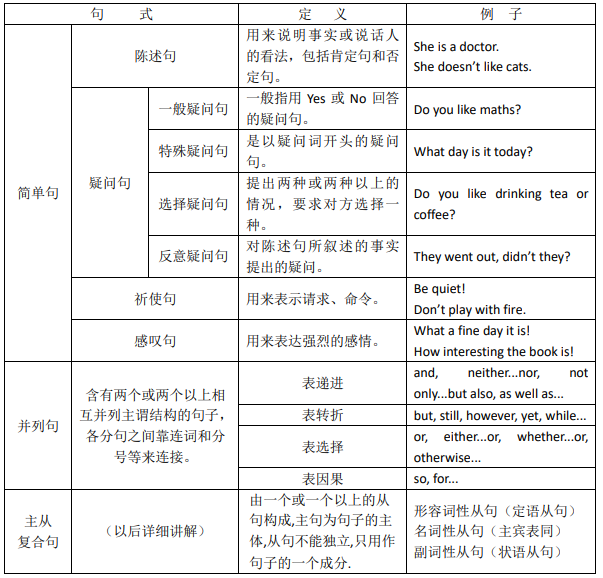
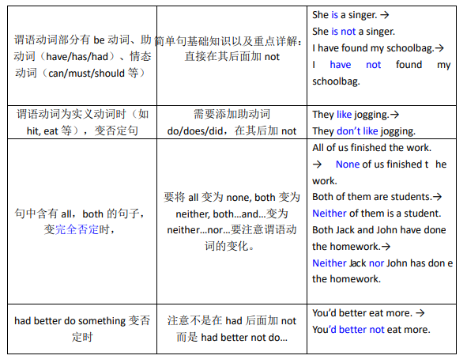
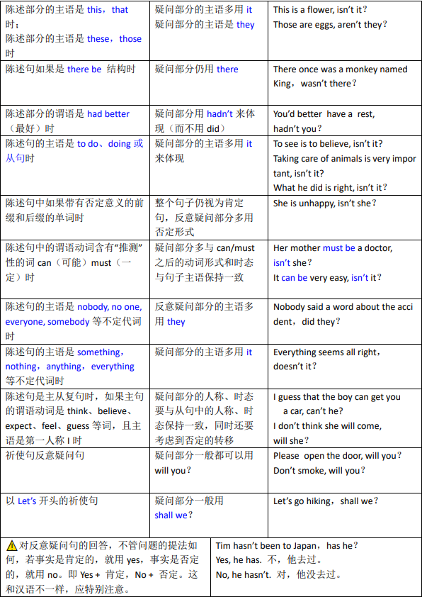
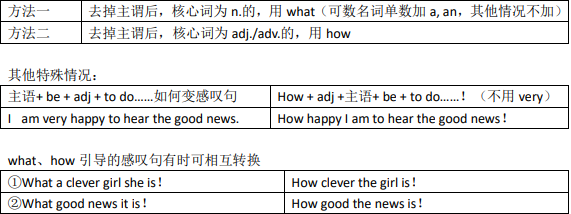

#  E01 英语的句子成分和五大基本句型

##  主、谓、宾、表、定、状、补语

- **主语**：句子叙述的主题，和宾语相对；主动语态发出动作，被动语态承受动作。

  例1：`I` sat down. （我坐下了）（动作的发出者）

  例2：`This English class` is very good. （这堂英语课很好）（被描述的对象）

  例3：`The little boy` was saved by the doctor. （那个小男孩被医生救了）（被动语态里动作的承受者）

  > 祈使句中往往省略主语。例：Stop!（You must stop!）

- **谓语**：谓：说、告诉。说清楚或告诉我们主语“做什么”或“是什么”。对主语动作、状态或特征的陈述或说明，也称为“述语”。

  例1：I `work in a bank`.（我在⼀家银⾏⼯作。）（谓语部分）

  例2：She `speaks a little French`.（她说⼀点法语。）（谓语部分）

- **宾语**：也称“受词”，动作的接受者，和主语相对。

  例1：I like `big cities`.（我喜欢⼤城市。）

  例2：He passed `me(间接宾语)` `the book(直接宾语)`.（他把书递给了我。）

- **表语**：表明主语的身份、性质、品性、特征或状态的语⾔（表明主语“是什么样”的语⾔）。位于系动词之后，⼆者缺⼀不可。

  例1：My brother is `a policeman`.（我的兄弟是⼀名警官。）

  例2：The flower smells `great`.（这些花闻起来很棒/很好闻。）

  例3：You look `tired`.（你看起来很累。）

  例4：I’m `tired` but I’m not `hungry`.（我累了但是我不饿。）

  - **（连）系动词：**把主语和表语“联系”在⼀起构成⼀个完整句⼦的动词。单独表述不清晰，不能独⽴作谓语。

    例1：She `is` a good swimmer.（她是⼀名游泳健将。）

    例2：Who `are` you?（你是谁？）

    例3：I `am` an office worker.（我是⼀个上班族。）

- **定语**：限定、修饰名词或代词等的语⾔

  例1：a `beautiful` girl（⼀个漂亮的姑娘）

  例2：a `family` business（⼀桩家庭买卖）

  例3：the place `I visited`（我参观过的那个地⽅）

- **状语**：状：形状、形式、样⼦、状态。“表示状态的语⾔”，如地点、时间、原因、⽬的、结果、条件、⽅向、程度、⽅式等，修饰谓语部分（动词、形容词、副词等）。

  例1：He works `hard`.（他努⼒⼯作。）**（⽅式状语）**

  例2：This is good `enough`.（这⾜够好了。）**（程度状语）**

  例3：He speaks English `quite` fluently.（他英语说得⼗分流利。）**（程度状语）**

  例4：She goes to work `every day`.（她每天上班。）**（时间状语）**

  例5：I learn English `online`.（我在⽹上学英语。）**（地点状语）**

  例6：`If I am not busy tomorrow`, I will play football with you.（如果我明天不忙，我就陪你踢球。）**（条件状语）**

- **补（⾜）语**：补充说明述语的结果、程度、趋向、可能、状态、数量，⽬的等成分。“补充说明主语或宾语细节的语⾔”，分**主语补⾜语（表语）**和**宾语补⾜语**。

  例1：I'm `angry`.（我⽣气了。）**（主语补⾜语）**

  例2：He became `a politician`.（他成了⼀名政客。）**（主语补⾜语）**

  例3：He made me `cry`.（他把我弄哭了。）**（宾语补⾜语）**

  例4：My father will not allow me `to go out`.（父亲不让我们在街上玩耍。）**（不定式作宾补）**

  例5：I found the classroom `empty`.（我发现教室⾥空⽆⼀⼈。）**（形容词作宾补）**

  例6：Ideas are scary. They come into this world `ugly and messy`.（想法是可怕的。他们来到这个世界上的时候丑陋⼜邋遢。）**（主语补⾜语）**

- **同位语**：⼀个句⼦成分对另⼀个句⼦成分进⾏解释或补充说明，这个句⼦成分就是同位语（地位
  相同的语⾔）。

  例1：This is my younger sister `Jane`.（这是我的妹妹简。）（This is my younger sister. This is Jane.）

  例2：Mr. Young, `our English teacher`, is a very handsome man.（杨⽼师，我们的英语⽼师，是⼀个⾮常帅⽓的年轻⼈。）

  例3：Paris, `the capital of France`, is a beautiful city.（巴黎，法国的⾸都，是⼀座美丽的城市。）

- **插⼊语**：在⼀个句⼦中间插⼊的⼀个成分， 本身不作句⼦的任何成分，只是对⼀句话附加说明。

  例1：Her youngest sister - the one who lives in Australia - is coming over next summer.（她的妹妹——在澳⼤利亚住的那个——明年夏天过来。）

  例2：`Strange`, there is nobody in the room.（很奇怪，屋⾥没⼈。）

  例3：`All in all`, this is a good trip.（总的来说，这次旅⾏很好。）

  例4：This man, `as you know`, is good for nothing.（这个男⼈，就像你知道的那样，⼀⽆是处。）

  例5：What `do you think` is the most important in your life?（你觉得你⽣命当中最重要的事情是什么？）

## 简单句的五大基本句型（五大动词句型）

- **主语+谓语（不及物动词）（+状语）：**

  **不及物动词：**不需要和“物”（宾语）在⼀起，或不直接跟宾语的动词。

  例1：He died.（他死了。）（painfully 痛苦地）
  例2：It hurts!（疼！）（badly 严重）
  例3：It happens.（这种事有时会发⽣。）（often 经常）
  例4：The method works.（这个办法有效。）（effectively 有效）

- **主语+谓语（及物动词）+宾语：**

  **及物动词：**需要和宾语在⼀起的动词。

  例1：I love you.（我爱你。）

  例2：He knows everything.（他什么都知道。）

  例3：She broke the rules.（她打破了规则。）

  例4：I caught a cold.（我感冒了。）

- **主语+谓语+间接宾语+直接宾语（双宾语）***（通常⼈做间接宾语，物做直接宾语）*

  例1：He passed me the book.（他把书递给了我。）

  例2：I showed him my passport.（我把护照拿给他看。）

  例3：He teaches me English.（他教我英语。）

- **主语+系动词+表语（主语补足语）**

  例1：I am Chinese.（我是中国⼈。）
  例2：She is very quiet.（她很安静。）
  例3：This place is beautiful.（这个地⽅太美了。）
  例4：I feel very happy.（我感到很⾼兴。）

- **主语+谓语+宾语+宾语补足语**

  例1：She made me happy.（她让我很⾼兴。）

  例2：We made him our monitor.（我们选他当班⻓。）

  例3：I found the game interesting.（我发现这个游戏很有趣。）

  例4：They consider this activity a waste of time.（他们认为这次活动浪费时间。）

## 英语中句子种类的划分

一般情况下，我们可以从两个不同的角度对句子进行分类：一是按句子的结构，可以分为简单句、并列句和主从复合句（从句）；二是按句子的用途，一个简单句可分为陈述句、疑问句、祈使句和感叹句。

### 简单句基础知识及详解

- **陈述句**，难点为肯定句变为否定句，有以下几种情况

  

- **疑问句**

  - 一般疑问句：一般指用Yes或No回答的疑问句。

    Is Timmy at home？ Yes, he is./No, he isn’t.

    Can you play the piano？ Yes, I can./No, I can’t.

    Have you been to Beijing？ Yes, I have./No, I haven’t.

  - 特殊疑问句：是以疑问词开头的疑问句。（注意：特殊疑问句不能用Yes或No回答，问什么答什么。）

    常用的疑问词有what，where，who，how，what time，how long等其他结构：

    What is your name？→My name is Mary.

    When do you get up？→I usually  get up at 6:30.

    Who is on duty today？→Tom is on duty Today.

    Whose ruler is blue？→Her ruler is blue.

  - 选择疑问句：提出两种或两种以上的情况，要求对方选择一种。这种疑问句叫选择疑问句。其结构：“一般疑问句+or+其他？”

    Is her brother a singer or a writer? 

    Shall we go to the cinema on Saturday or on Sunday？

    注意：回答时不用Yes或No，直接回答（根据事实回答）。

    如：—Does he like English or Chinese？

    —He likes  Chinese.

  - 反意疑问句：在陈述句之后，对陈述句所叙述的事实提出的疑问。其基本结构有两种：一是“前肯后否”；二是“前否后肯”。反意疑问句的前后两部分在时态、人称和数上都要保持一致。

    It looks like ice，doesn’t it？

    He can't be her father, is he?

    He seldom came here, did he?  (seldom, hardly, little, barely 等这些都是表达否定含义的词，反义疑问句用肯定)

    He dislikes the two subjects, doesn't he?  (dislike 是动词前缀含有否定意味，依然是肯定的表达，故反义疑问句用否定)
    
    反意疑问句，特别要注意以下的一些特殊情况
    
    

- **祈使句**

  (1) 祈使句是用来表示请求、命令、劝告或建议等语气的句子。它的主语多是You（通常不说出）。例如：

   (You) Keep silent!

  (2) 祈使句可分为肯定、否定两种形式。其中肯定形式的祈使句由动词原形开头，否定形式的构成是一律在肯定形式的祈使句之前加上Don’t。例如：

  Don’t open the door！不要开门。

  Don’t be late for class again！别再上课迟到了。

  (3) 由let构成的肯定式的祈使句句型为:

  Let+宾语+动词原形+其它。例如：

  Let me have a good rest. 让我好好休息一下。

  (4)  以let引起的祈使句的否定形式，要视其在意思上否定了什么来决定。

  如否定let，则用Don’t let…，若否定let后面的不定式，则在动词前加not，即用“Let+宾语+not+动词原形+其它。” 例如：

  Don’t let the children play football on the road.不要让孩子们在马路上踢球。

  Let’s not wait outside the gate.咱们别在门外等。

  (5) 祈使句式的肯定式前加do可起强调作用。意为“务必；一定”等。

  Do come, please！请一定来！

  Do tell her the whole thing. 务必告诉她整件事。

- **感叹句**

  感叹句通常由what或how引导，例如：

  What a lovely dog it is!

  What interesting books the children are reading!
  
  What important news it is!
  
  How tall the man is!
  
  How quickly he ran!
  
  How time flies!
  
  **如何判断用 what 还是 how**
  
  
  
  

# E02 名词和冠词

## 英语的词性和相关概念

- **英语的⼗⼤词性：**

  1. noun [naʊn] n. 名词（简称n.）
  2. article [ˈɑːtɪkl; 'ɑrtɪkl] n. 冠词（简称art.）
  3. pronoun ['prəʊnaʊn] n. 代词（简称pron.）
  4. verb [vɜːb; vɜːrb] n. 动词（简称v. 分vt.和vi.）
  5. adjective ['ædʒɪktɪv] n. 形容词（简称adj.）
  6. adverb [ˈædvɜːb; ˈædvɜːrb] n. 副词 adj. 副词的（简称adv.）
  7. preposition [ˌprepə'zɪʃ(ə)n] n. 介词；前置词（简称prep.）
  8. conjunction [kən'dʒʌŋkʃn] n. 连词（简称conj.）
  9. numeral [ˈnjuːmərəl; ˈnuːmərəl] n. 数词（简称num.）
  10. interjection [ˌɪntəˈdʒekʃn; ˌɪntərˈdʒekʃn] n. 感叹词（简称int.）

- **英语的实词和虚词：**

  **实词：**实：实际、实在。有实际意义，可以独⽴充当句⼦成分的词。

  **虚词：**虚：空、⽆。没有实际意义，不能独⽴充当句⼦成分的词。

- **词性和句⼦成分的区别：**

  **词性：**单词本身的属性，不依托句⼦存在。

  **句⼦成分：**单词在句⼦⾥所属的组成部分，依托句⼦存在。

  例：This is a great English course.（这是⼀⻔很棒的英语课。）

  **词性：**This(代词) is(be动词) a(冠词) great(形容词) English(名词) course(名词).

  **句⼦成分：**This(主语) is(系动词) a great English course(名词短语作表语).

## 名词的定义和作用

### 名词的定义

表示名称的词，包括⼈、事、物、地点或抽象概念等。

### 名词的作用

- **作主语：**

  `Knowledge` is power.（知识就是⼒量。）

  `Practice` makes perfect.（熟能⽣巧。）

- **作宾语：**

  I forgot to bring `my phone`.（我忘带⼿机了。）

  Don’t eat the `cake`.（别吃那块蛋糕。）

- **作表语：**

  This is `my English teacher`.（这是我的英语⽼师。）

  Smoking is `a bad habit`.（抽烟是⼀个坏习惯。）

- **作定语：**

  `sports` meeting（运动会）

  `blood` pressure（⾎压）

  `diamond` ring（钻⽯戒指）

  > 问：名词修饰名词，和形容词修饰名词有什么区别？
  >
  > 答：侧重点不同。名词修饰名词时，前后两者都侧重；形容词修饰名词时，只是为了表达后者名词的特点。

- **作同位语：**

  This is my partner, `Young`.（这是我的搭档，杨。）

  You `girls` sit on this side.（你们⼥孩⼦们坐这边。）

## 专有名词和普通名词

### 专有名词

特定的或独⼀⽆⼆的⼈或物。

- **⼈名：**David（⼤卫）

- **地名：**Beijing（北京）

- **国家名：**China（中国）

- **景观名：**the Great Wall（⻓城）

- **特有概念：**Sunday, January, Christmas（周⽇，⼀⽉，圣诞节）

### 普通名词

代表⼈、物、抽象概念等的名词。

- ⼈：boy, girl, man, woman, etc.（男孩，⼥孩，男⼈，⼥⼈等）
- 物：desk, pen, computer, mouse, etc.（桌⼦，钢笔，电脑，⿏标等）
- 抽象概念：happiness, misery, success, failure, etc.（幸福，痛苦，成功，失败等）

**普通名词的四类**

- 个体名词：student, house, aunt, etc.（学⽣，房⼦，阿姨等）
- 集合名词（群体）：family, enemy, audience, furniture, etc.（家庭，敌⼈，听众，家具等）
- 物质名词（⽆法分为个体）：
  - 液态：milk, water, etc.（⽜奶，⽔等）
  - ⽓态：gas, air, etc.（⽓体，空⽓等）
  - 糊状：toothpaste, glue, etc.（⽛膏，胶⽔等）
- 抽象名词（⾮实物）：beauty, anger, patience, etc.（美丽，⽣⽓，耐⼼等）

## 名词的可数和不可数

**常见可数名词变复数的方式何原因：**

- ⼀般情况加 -s。
- 以s, x, ch, sh结尾的词，加-es。（读⾳⽅便）
- 辅⾳字⺟+y结尾的词，y变i加-es。（y为短元⾳，变-ies可避免短⾳y弱读为[ə]）
- 以-o结尾的词，许多加-es构成复数。（避免o读成单元⾳，如toss和toes）
- 元⾳字⺟+o结尾的词，加-s。（形成双元⾳或⻓u⾳）
- 缩写词或外来语，加-s。
-  以-f或-fe结尾的词，变为-ves，读[vz]。（f本身发清⾳，直接加-s发⾳不易被察觉，-ves中间的e起拼写连接作⽤）

**不规则的名词复数形式**

man-men, woman-women, tooth-teeth, foot-feet, mouse-mice, goose-geese, ox-oxen, children, etc.

**单复数同形的情况**

fish, sheep, deer, etc.

表示某国人的名词: I’m a Chinese. They are all Chinese.（我是中国人。他们都是中国人。）

**有的名词只有复数**

scissors（剪⼑）, pants（裤⼦）, shorts（短裤）, belongings（所有物、财产），goods（货物）

**复合名词变复数，只变更主体，不变更作定语的名词：**

girl friends（⼥性朋友们）; apple pies（苹果派）; orange trees（橘⼦树）

**注意：**man或woman有关的复合名词，前后都变化。(因为是突出群体中的每个个体。)

例：women doctors（女医⽣们）; men teachers（男⽼师们）

**常见的名词复数表特殊含义**

papers 论⽂； drinks 饮料； times 时代/倍； works ⼯⼚；arms 武器；
waters ⽔域； contents ⽬录； savings 存款； woods 森林； manners 礼貌；

## 名词所有格

在英语当中，⽤特殊的“格式”来表示名词对其它词的“所有关系”，就叫做“名词所有格”。

**对比名词所有格和of表从属关系的用法区别：**

- 突出事物的所有者，而非事物本身，多用’s：

  the company’s decision（公司的决定）（集合名词）

  China’s imports and exports（中国的进⼝和出⼝）（国家）

  the horse’s mouth（那匹⻢的嘴）（动物）

- 突出事物本身，而非事物的所有者，多用of：

  the roof of the house（这座房⼦的屋顶）
  the name of the song（这⾸歌的名字）
  the leg of the table（这张桌⼦的桌腿）
  the library of the school（学校的图书馆）

### 名词短语和冠词

**名词短语**： 名词和它的修饰语⼀起构成的，从语法功能上仍然相当于名词的短语。

例1：I saw `a beautiful little girl` on the way home.（我在回家路上⻅到⼀个漂亮的⼩姑娘。）
例2：This is `an interesting fact`.（这是⼀个有趣的事实。）
例3：`The brave man` is `a hero in this country`.（那个勇敢的⼈是这个国家的英雄。）
例4：Don’t hurt `these cute animals`.（不要伤害这些可爱的动物。）
例5：`Some people` said they saw `the whole thing`.（⼀些⼈说他们⽬睹了整件事。）
例6：`My English teacher` is `a very good man`.（我的英语⽼师是⼀个很好的⼈。）

**冠词**

 不能单独使⽤，只能⽤于名词之前帮助说明名词所指的⼈或事物的词；

属于限定词**（**限定名词数量多少或特指等的词）的⼀种。

**不定冠词**：a, an（one的读⾳弱化）
**定冠词**：the（that的读⾳弱化）
